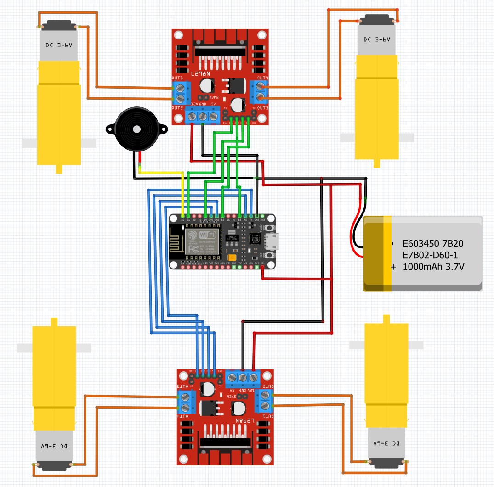

# Mecanum Wheel Car

The goal of this project is to build a remote controlled car with Mecanum wheels. 
The car will be controlled using the app "Dabble" and powerd by an ESP32.
Total cost is about 84€, and access to a 3D Printer is required.

## Mecanum Wheels

Mecanum Wheels are capable of moving sideways. They are often used in industrial applications to move stuff around, or sometimes on forklifts. 

The car will be able to move forward, backward, left, right, turn left, and turn right.

For a good explanation I suggest watching this youtube video: youtube.com/watch?v=noqBUEgyQ8A

## BoM

Tldr: ~84€ on Aliexpress

[Here is the BoM](BoM.xlsx)

## Circut diagram
The ESP32 used in this diagram is different to the one I used. 
The pin positions are the same though. In the BoM I have linked the right one.

## Code

You can find the documentation for Dabble [here](https://ai.thestempedia.com/docs/dabble-app/gamepad-module/)

## CAD

